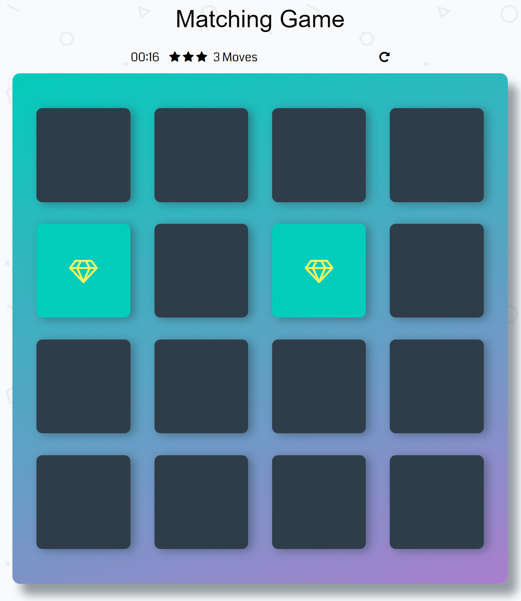
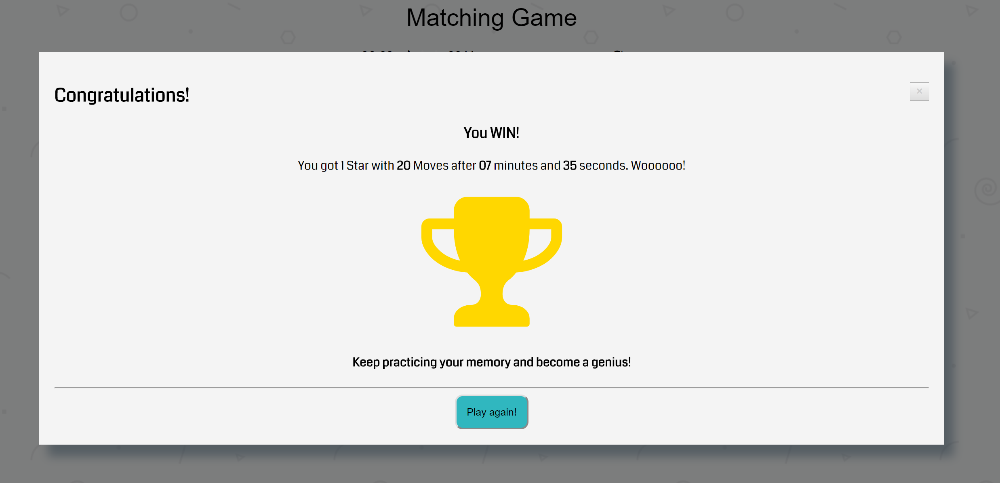

# Memory game

## What Will I Build?
The Memory Game Project is all about demonstrating my mastery of HTML, CSS, and JavaScript. I built a complete browser-based card matching game (also known as Concentration). But this isn’t just any memory game! It’s a shnazzy, well-designed, feature-packed memory game!

## How The Game Works
The game board consists of sixteen "cards" arranged in a grid. The deck is made up of eight different pairs of cards, each with different symbols on one side. The cards are arranged randomly on the grid with the symbol face down. The gameplay rules are very simple: flip over two hidden cards at a time to locate the ones that match!

Each turn:

The player flips one card over to reveal its underlying symbol.
The player then turns over a second card, trying to find the corresponding card with the same symbol.
If the cards match, both cards stay flipped over.
If the cards do not match, both cards are flipped face down.
The game ends once all cards have been correctly matched.

## Game Functionality
The real-life game, players flip over cards to locate the pairs that match The goal is to recreate this effect in this project. There are a couple of interactions that I needed to handle:

The game board consists of sixteen cards arranged randomly in a grid. The deck is made up of eight different pairs of cards, each with different symbols on one side. Each turn:

* A player flips one card over to reveal its underlying symbol
* The player then turns over a second card, trying to find the corresponding card with the same symbol
* If the cards match, both cards stay flipped over
* If the cards do not match, both cards are returned to their initial hidden state
* The game ends once all cards have been correctly matched.

#### Flipping cards
When the first card is clicked, the timer stars and the card is shown. After that, another card is clicked and the moves counter is increased (1 move consists of flipping 2 cards).

If 2 consecutive cards match, they remain displayed and their color is changed.

If 2 consecutive cards don't match, thir image is hidden.

When the game finishes (all the cards matched) a modal with a congratulating message is displayed. It also contains the number of stars gained (3 - for completing the game in 14 moves or less, 2 - for completing the game in 15 or 16 moves and 1 - for completing the game in more than 16 moves), the time needed to finish the game and the number of moves. 
